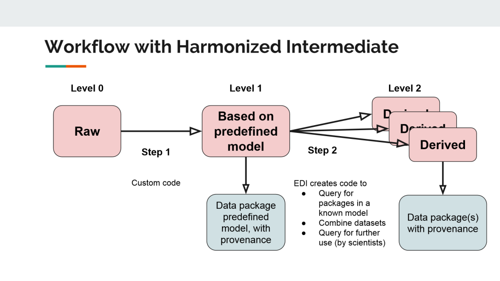

# warmXtrophic

## Introduction

This repository contains R scripts that organize, clean, analyze, and plot data from the long-term Warming X Trophic Interactions experiment at Kellogg Biological Station (KBS) and University of Michigan Biological Station (UMBS). A manuscript is currently in review summarizing the data from 2015-2021, co-led by Kara Dobson and Moriah Young, coauthors: Phoebe Zarnetske, Mark Hammond.

Young, M. L., Dobson, K. D., Hammond, M. D., Zarnetske, P. L. In review. Plant
community responses to direct and herbivore-mediated indirect effects of climate warming
across multiple years. Ecology. *Moriah and Kara are joint first authors

## Workflow

L1 data must be downloaded prior to running the R script associated with that response variable. Each response variable (e.g., biomass, green-up, etc.) typically has its own R script for cleaning and analysis. Some traits are grouped for L2 figure making scripts (e.g., leaf traits are SLA, C, and N). For some L2 scripts, the L1 data must first be ran through its associated L1 script to create the data necessary for L2.

## Location of data

The L1 data that are processed in the scripts in this repository will be published as an EDI package (DOI here). In some scripts, the header may state that the data was input from Google Drive, which is an artifact of our data processing steps.

## Spatiotemporal extent

- Spatial extent: Two experimental sites in Hickory Corners (Kellogg Biological Station) and Pellston (University of Michigan Biological Station), MI, USA.
- Temporal extent: 2015-2021

## Usage

All analyses were conducted using R (R Core Team 2020)

### File Naming Conventions

- Data Files: File names typically contain the response variable, site, and data stage designation. For example, "UMBS_pairedsensors_L1.csv" would represent data from UMBS for the air temperature paired sensors as a clean, L1 version. Some data files may not have a site name (e.g., "final_flwr_sd_L1.csv"), meaning both KBS and UMBS are contained within that file. More meta-data file information is avaiable in our EDI data repository.
- Scripts: Scripts are separated into two folders: L1 and L2. L1 files take raw data and clean it, thus resulting in our clean L1 data files available in EDI. The L2 files take the cleaned data and analyse/plot it. Scripts are named with their respecitive response variable and if the data is being analyzed or plotted (e.g., "herbivory_analyses_L2.R and herbivory_plots_L2.R").

## Scripts

### L1

The L1 scripts take raw data files and clean them into L1 data versions. The clean L1 data is already available on our EDI repository. We do not currently have raw, L0 data available in our EDI repository, but it may be published in a future version of the repo.

Scripts with "functions" in the file name (e.g., "biomass_functions.R") contain functions used in that response variables' cleaning script. Cleaning scripts are designated with "clean" in the file name (e.g., "biomass_clean_L1.R"). The "HOBO_pairedsensor_cleanup" and "HOBO_pendantdata_cleanup" scripts take the raw HOBO data and clean it, and those scripts are followed by the "HOBO_pairedsensor_merge" and "HOBO_pendantdata_merge" scripts, which then merge together all clean HOBO data.

A few L1 scripts take pre-cleaned L1 data and do a second transformation. These include the HOBO_data_removal.R script and the HOBO_GDD_L1.R script.

HOBO_data_removal.R: Takes the clean, L1 data files from the paired sensors cleaning scripts (e.g., "UMBS_pairedsensors_L1.csv") and remove outliers/inaccurate data. The output of this script makes a version of L1 data with some data removed (e.g., "UMBS_pairedsensors_dataremoved_L1.csv").

HOBO_GDD_L1.R: uses the clean, L1 data from the HOBO_data_removal.R script and calculates cumulative GDD and median, mean, and max temperatures for given timeframes. The HOBO_data_removal.R script must be ran prior to running this script.

### L2

## Contributors

PI: Phoebe Zarnetske

Collaborators: Mark Hammond, Moriah Young, Kara Dobson, Emily Parker

Prior collaborators/technicians: Nina Lany, Kileigh Welshofer, Kathryn Schmidt, Amy Wrobleski

## Contact

For inquiries related to the data and scripts, please contact Phoebe Zarnetske: @plz@msu.edu

## Old (need to place elsewhere above)

Funding: Michigan State University (including Kellogg Biological Station, and KBS LTER)

The experiment began in June 2015 and at each site includes the following treatments:

2015-2017: warming (via open top chambers), herbivore reduction (via insecticide, small mammal exclosures)

2018-2021: warming (via open top chambers), herbivore reduction (via insecticide). In 2018 we removed the small mammal exclosures as they did not affect any of the plant response variables.

The total number of replicates for each treatment is 6 at each site, excluding the small mammal treatment.

Response variables include:

Phenology: greenup

Phenology: flowering

Phenology: flowering duration

Phenology: seed set

Community composition: percent cover

Herbivory: percent of plant species eaten at end of summer

Biomass (computed from relationship between community composition and biomass of similar plots outside experiment)

In 2017 we added C&N composition and SLA from plant leaves for a few species.
